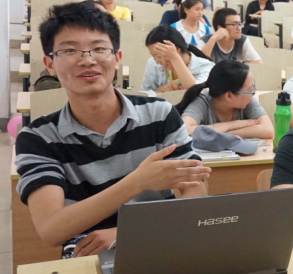

SACC Entry Quiz: C & Common
===

<style>
	ul { list-style-type: none; margin-top: 0rem; padding-left: 2ch;}
	ul li { margin-right: 3ch; }
	ul li:last-child {margin-right: 0!important;}
	ul li::before {font-family: monospace; padding-right: 0.5ch;}
	ul li:nth-child(1)::before { content: "A."; }
	ul li:nth-child(2)::before { content: "B."; }
	ul li:nth-child(3)::before { content: "C."; }
	ul li:nth-child(4)::before { content: "D."; }
	ul li:nth-child(5)::before { content: "E."; }
	ul li:nth-child(6)::before { content: "F."; }
	ul li:nth-child(7)::before { content: "G."; }
	h5 {
		margin-top:    2rem;
		margin-bottom: 0.5rem;
	}
	li img {
		height: 6rem;
		width:  auto;
	}
	h4~p img {
		display: inline-block;
		height: 12rem;
		margin-left:  2rem;
		margin-right: 2rem;
	}
</style>

<style>
	/* override nth question's ul to inline/custom layout */
	
	/* Q0: image choice display */
	ul:nth-of-type(1) li { 
		position: relative;
		display: inline-block;
		margin-right: 1ch;
	}
	ul:nth-of-type(1) li:before{
		position: absolute;
		bottom: 0; left: 0;
		width: 4ch;
		text-align: center;
		background-color: #fff;
	}
	
	/* Q1: simple choices */
	ul:nth-of-type(2) li { display: inline-block; }
	ul:nth-of-type(4) li {	display: inline-block; }
	ul:nth-of-type(5) li { display: inline-block; }
	ul:nth-of-type(7) li { display: inline-block; }
	ul:nth-of-type(8) li { display: inline-block; }
	ul:nth-of-type(9) li { display: inline-block; }
</style>

|   | 0 | 1 | 2 | 3 | 4 | 5 | 6 | 7 | 8 | 9 | a | b | c | d |
|---|---|---|---|---|---|---|---|---|---|---|---|---|---|---|
| : |   |   |   |   |   |   |   |   |   |   |   |   |   |   |

**e,f写在第一张纸的背面**


##### 0. 以下四张照片，哪一个是科协主席：
* 
* 
* 
* 


##### 1. `strlen("abc\0")`的结果是： 
* `3`
* `4`
* `5`
* `6`


##### 2. 编译、运行这段代码会发什么？
```C
#include <stdio.h>
int main() {
	int  n   = 0;
	int* ptr = (int*)0;
	/* 提示： 访问ptr指向的元素让程序崩溃喔！ */
	if ( (n=2) || (*ptr>=1) )
		printf("hello world!");
	else
		printf("goodbye cruel world");
}
```
* 运行时崩溃了
* 编译时报错
* 输出`hello world!`
* 输出`goodbye cruel world`


##### 3. 这段代码的输出是：
```C
#include <stdio.h>

int morph(int a) {
	static int called = 0;
	printf("%d ", called++);
	return a*a;
}

int main() {
	morph(1);
	morph(2);
	morph(3);
}
```
* `0 0 0`
* `1 1 1` 
* `0 1 2`
* `1 2 3`


##### 4. 编译、运行这段代码会发什么？
```C
#include <stdio.h>
int main() {
	short array[] = {0x0123, 0x4567, 0x89ab, 0xcdef};
	char* ptr     = (char*) &array;
	printf("%x\n", ++ptr[3]);  /*提示：%x输出16进制值 */
}
```
* `89ab`
* `89ac`
* `89`
* `8a`
* `45`
* `46`


##### 5. 以下哪一种**不是**main函数的标准形式（按照C99标准）
* `int main (void)`
* `int main (int argc, char *argv[])`
* `int main (int moe, char **girl)`
* `void main (void)`


##### 6. 这段代码的输出是：
```C
#include <stdio.h>
/* 提示：F(v) 把v转换为浮点数 */
#define F(v) ((float)(v))
int main() {
	printf( "%.2f %.2f\n", F(3/2), F(3/2.0) );
}
```
* `1.00 1.00`
* `1.00 1.50`
* `1.50 1.00`
* `1.50 1.50`


##### 7. 这段代码的输出是：
```C
#include <stdio.h>
int main() {
	short a = 32767;
	short b = 32767;
	++a;
	printf("%d %d\n", a, b+1);
}
```
* `32768 32768`
* `32768 -32768`
* `-32768 32768`
* `-32768 -32768`


##### 8. 这段代码的输出是：
```C
#include <stdio.h>
int main() {
	char mtx[3][4] = {
		'0', '1', '2', '3', '4', '5',
		'6', '7', '8', '9', 'a', 'b'
	};
	for (int i=0; i!=2; ++i)
		for (int j=0; j!=2; ++j)
			putchar(mtx[i][j]);
}
```
* `0134`
* `0145`
* `0314`
* `0415`


##### 9.  以下哪段代码能通过编译并执行（运行不出错）
* `char* const s="hello";   s="world";`
* `char const* s="hello";   s="world";`
* `char* const s="c";   s[0]='d';`
* `char const* s="c";   s[0]='d';`


##### a. Good g00d 3nglish, Clean c1ean code. 阅读材料，回答问题
In C, we have a convenient `qsort` function to sort an array of elements. Here's specification:

```C
void qsort( void *ptr, size_t count, size_t size,
            int (*comp)(const void *, const void *) );
```
> Sorts the given array pointed to by ptr in ascending order. The array contains count elements of size bytes. Function pointed to by comp is used for object comparison.
 
Given context:

```C
int arr[4] = {3, 2, 5, 1};
int cmp(const void* pa, const void* pb) {
	return (*(const int*)pa) - (*(const int*)pb);
}
```

**Question:** Which code will sort `arr` in ascending order, with any compiler, on any operating system.

* `qsort(arr, 4, 2, cmp);`
* `qsort(arr, 2, 4, cmp);`
* `qsort(arr, 4, 4, cmp);`
* `qsort(arr, 4, sizeof(int), cmp);`
* `qsort(arr, sizeof(int), 4, cmp);`
* `qsort(arr, sizeof(arr), sizeof(int), cmp);`


##### b. `Linux的定义是Linux Is Not UniX`体现了计算机中的哪个重要概念
* 递归 (Recursion)
* 递推/迭代 (Iteration)
* 缩写 (Abbreviation)
* 反射 (Reflection)


##### c. 蒻蒻的std是单身狗并且找不到妹子在科协是众所周知的，那么妹子与std的玩具们相比，有哪个特征：
* 在冬天，妹子可以暖手
* 妹子颜值高，可以养眼
* 妹子对激励的响应有不确定性
* 妹子可以和std玩耍（除了期末考试前的1个月）


##### d. 蒻蒻的std在编写一个由**多人合作**的项目的程序代码时，应该优先考虑代码的：
* 运行效率
* 健壮性
* 易读性
* 文件大小


##### e. 简要说明：你的专业做什么；你加入的科协小组学什么；
请具体说明。
过于简单的答案**会影响**你的成绩。


##### f. 编程：2-10 ／ 2-16 转换
天真的std不明白为什么2-10进制转换在计算机中的重要性。屈大大用**获取IPv4网络号**为栗子：

IPv4地址是32位二进制数，因为记忆一个32位二进制数很困难，我们把32位数分为4段(segment)8位二进制数(byte)，用.号连接，这样就有了我们日常使用的类似`192.168.1.100`的IP地址。

网络号为IP地址的前N位。对IPv4 CIDR地址`192.168.1.100/24`，`/24`表明了网络号长度(prefix)为24位。将IP地址的高N位保留，其余位置0，就得到了网络号。

```Text
Bit  31                          8         0
Dec        192       168         1       100
Bin   11000000  01101000  00000001  00110100
Msk   ********  ********  ********          
Ntw   11000000  01101000  00000001  00000000
```

屈大大觉得嘴上胡扯效果不好，所以他想写个程序让std自己玩。但是屈大大太忙了，根本没有时间写这个程序，于是就把这个任务交给你了。

**要求：**

1. 从标准输入(stdin)读一个CIDR地址（形如`nnn.nnn.nnn.nnn/pfx`）
2. 按照上面所说的规则，计算出网络号
3. 将网络号按照IPv4格式输出
4. `nnn`为`0-255`之间的整数
5. `pfx`为`0-32`之间的的整数
6. 不需要检查输入合法性

样例输入：`192.168.1.100/24`
样例输出：`192.168.1.0`

**注意：**

1.  写出表现程序逻辑的关键代码、变量声明、循环、判断
2.  你可以在`scanf`中用`%hhu`读取一个`0-255`之间的无符号整数
3.  `pfx`**不一定**是8的倍数！
4.  可以用行首缩紧代替大括号（python风格）
5.  可以使用C语言标准库函数，不需要写出头文件
6.  可以定义函数、宏
7.  不需要严格按照C语言源程序结构（可以省略main，返回值等）；
8.  少写{分号、花括号、变量声明}**不影响**成绩
9.  糟糕的缩进、变量名、变量类型**会影响**成绩，或直接0分
10. 可以用脚本语言写这个程序（比如PyPy）
11. 参考答案共⑨行，没有使用函数 （不包含结构代码）


